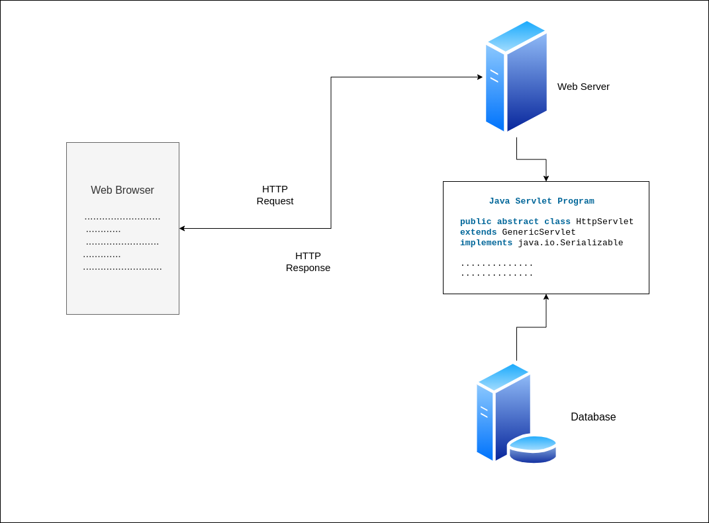

# CV2_ServletApp_Example

# What is Java Servlet?

Java Servlets are the Java programs that run on the Java-enabled web server or application server. They are used 
to handle the request obtained from the web server, process the request, produce the response, and then send a response back to the web server. 

Properties of Java Servlet
The properties of Servlets are as follows:

Servlets work on the server side.
Servlets are capable of handling complex requests obtained from the web server.

# Execution of Java Servlets

Execution of Servlets basically involves Six basic steps: 

The Clients send the request to the Web Server.
The Web Server receives the request.
The Web Server passes the request to the corresponding servlet.
The Servlet processes the request and generates the response in the form of output.
The Servlet sends the response back to the webserver.
The Web Server sends the response back to the client and the client browser displays it on the screen.
Now let us do discuss eccentric point that why do we need For Server-Side extensions?

# helpful links with more information

[Servlet info ](https://www.geeksforgeeks.org/introduction-java-servlets/)

[Jakarta Servlet ](https://jakarta.ee/learn/docs/jakartaee-tutorial/current/web/servlets/servlets.html)

[Servlet video cz/sk ](https://www.youtube.com/watch?v=z5uvktj66gg)
